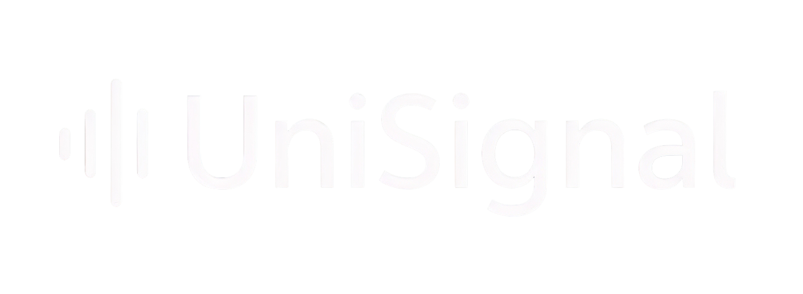

<p align="center">
  
</p>

A lightweight, zero-allocation signal (event) library for Unity. Decouple your systems with type-safe, struct-based signals — no strings, no boxing, no garbage.

[](#) [](#) 

## Features

- **Type-safe signals** — signals are structs, caught at compile time
- **Zero GC in steady state** — subscription objects are pooled and recycled automatically
- **Multiple subscription modes** — by type, by specific value, or by predicate
- **Reentrant dispatch** — subscribe/unsubscribe safely from inside a signal callback
- **Listener-based bulk unsubscribe** — pass `this` as listener, then unsubscribe everything in one call (great for `OnDestroy`)
- **No singletons** — create as many `SignalHub` instances as you need (global, per-scene, per-entity)

## Table of Contents

- [Installation](#installation)
- [Quick Start](#quick-start)
- [Defining Signals](#defining-signals)
  - [Simple Signals](#simple-signals)
  - [Signals with Data](#signals-with-data)
  - [Matchable Signals](#matchable-signals)
- [Subscribing](#subscribing)
  - [By Signal Type](#by-signal-type)
  - [By Signal Type with Data](#by-signal-type-with-data)
  - [By Specific Value](#by-specific-value)
  - [By Predicate](#by-predicate)
  - [By Predicate with Data](#by-predicate-with-data)
  - [Without a Listener](#without-a-listener)
- [Dispatching](#dispatching)
- [Unsubscribing](#unsubscribing)
  - [Single Subscription](#single-subscription)
  - [All Subscriptions of a Listener](#all-subscriptions-of-a-listener)
  - [All Subscriptions of a Listener for a Specific Signal](#all-subscriptions-of-a-listener-for-a-specific-signal)
  - [All Subscriptions of a Signal Type](#all-subscriptions-of-a-signal-type)
- [API Reference](#api-reference)
- [Performance](#performance)
- [Tests](#tests)
- [License](#license)

## Installation

### Option 1: Unity Package Manager (UPM)

1. Open **Window → Package Manager**
2. Click **+** → **Add package from git URL...**
3. Enter:
```
https://github.com/actionk/UniSignal.git#1.0.0
```

### Option 2: manifest.json

Add to your `Packages/manifest.json`:

```json
"com.actionik.polymorphex.unisignal": "https://github.com/actionk/UniSignal.git#1.0.0"
```

## Quick Start

```csharp
// 1. Define a signal
public struct PlayerDiedSignal : ISignal { }

// 2. Create a hub (or inject one via DI)
var signalHub = new SignalHub();

// 3. Subscribe
signalHub.Subscribe<PlayerDiedSignal>(this, () =>
{
    Debug.Log("Player died!");
});

// 4. Dispatch
signalHub.Dispatch(new PlayerDiedSignal());

// 5. Cleanup
signalHub.Unsubscribe(this);
```

## Defining Signals

### Simple Signals

A signal is any struct that implements `ISignal`. It can be completely empty if you only need to notify that something happened:

```csharp
public struct GameStartedSignal : ISignal { }
public struct GameOverSignal : ISignal { }
```

### Signals with Data

Signals can carry data. Subscribers can optionally receive it:

```csharp
public struct DamageSignal : ISignal
{
    public int amount;
    public Entity source;
}
```

### Matchable Signals

If you want subscribers to match on a **specific signal value** (not just the type), implement `ISignal<T>` which requires `IEquatable<T>`:

```csharp
public struct ItemPickedUpSignal : ISignal<ItemPickedUpSignal>
{
    public int itemId;

    public bool Equals(ItemPickedUpSignal other) => itemId == other.itemId;
    public override int GetHashCode() => itemId;
}
```

This enables subscribing to, for example, only item ID `42` being picked up.

## Subscribing

All `Subscribe` overloads return a `SignalSubscription<T>` that can be used to unsubscribe later.

### By Signal Type

Callback fires for **every** signal of that type.

```csharp
// Without data
signalHub.Subscribe<DamageSignal>(this, () =>
{
    Debug.Log("Something took damage");
});

// With data
signalHub.Subscribe<DamageSignal>(this, (DamageSignal signal) =>
{
    Debug.Log($"Took {signal.amount} damage");
});
```

### By Signal Type with Data

Same as above, but the callback receives the signal struct:

```csharp
signalHub.Subscribe<DamageSignal>(this, (DamageSignal signal) =>
{
    healthBar.SetValue(healthBar.Value - signal.amount);
});
```

### By Specific Value

Only fires when the dispatched signal **equals** the subscribed value. Requires `ISignal<T>`:

```csharp
// Without data
signalHub.Subscribe(this, new ItemPickedUpSignal { itemId = 42 }, () =>
{
    Debug.Log("Picked up item 42!");
});

// With data
signalHub.Subscribe(this, new ItemPickedUpSignal { itemId = 42 }, (ItemPickedUpSignal signal) =>
{
    Debug.Log($"Got item {signal.itemId}");
});
```

### By Predicate

Only fires when the predicate returns `true`:

```csharp
// Without data
signalHub.Subscribe<DamageSignal>(this,
    signal => signal.amount > 50,
    () => Debug.Log("Big hit!")
);

// With data
signalHub.Subscribe<DamageSignal>(this,
    signal => signal.amount > 50,
    (DamageSignal signal) => Debug.Log($"Big hit: {signal.amount}")
);
```

### By Predicate with Data

```csharp
signalHub.Subscribe<DamageSignal>(this,
    signal => signal.source != Entity.Invalid,
    (DamageSignal signal) =>
    {
        Debug.Log($"Damage from {signal.source}: {signal.amount}");
    }
);
```

### Without a Listener

You can omit the listener object. This is useful for static or one-off subscriptions, but you won't be able to bulk-unsubscribe by listener:

```csharp
signalHub.Subscribe<GameStartedSignal>(() => Debug.Log("Game started"));
```

## Dispatching

```csharp
signalHub.Dispatch(new DamageSignal { amount = 25 });
```

Dispatch is **reentrant** — it's safe to subscribe, unsubscribe, or dispatch again from inside a callback. Changes are queued and applied after the current dispatch completes.

## Unsubscribing

### Single Subscription

```csharp
var sub = signalHub.Subscribe<DamageSignal>(this, () => { });

// Either via the hub:
signalHub.Unsubscribe(sub);

// Or directly on the subscription:
sub.Unsubscribe();
```

### All Subscriptions of a Listener

Removes **all** subscriptions (across all signal types) registered with this listener object. Ideal for `OnDestroy`:

```csharp
signalHub.Unsubscribe(this);
```

### All Subscriptions of a Listener for a Specific Signal

Removes only subscriptions of a specific signal type for the given listener:

```csharp
signalHub.Unsubscribe<DamageSignal>(this);
```

### All Subscriptions of a Signal Type

Removes **all** subscriptions of a signal type, regardless of listener:

```csharp
signalHub.UnsubscribeAllFrom<DamageSignal>();
```

## API Reference

### SignalHub

| Method | Description |
|---|---|
| `Subscribe<T>(listener, callback)` | Subscribe to all signals of type `T` |
| `Subscribe<T>(listener, Action<T>)` | Subscribe with signal data |
| `Subscribe<T>(listener, predicate, callback)` | Subscribe with a filter predicate |
| `Subscribe<T>(listener, predicate, Action<T>)` | Subscribe with predicate + signal data |
| `Subscribe<T>(listener, signal, callback)` | Subscribe to a specific signal value (`ISignal<T>`) |
| `Subscribe<T>(listener, signal, Action<T>)` | Subscribe to a specific value with data |
| `Dispatch<T>(signal)` | Dispatch a signal to all matching subscribers |
| `Unsubscribe(subscription)` | Remove a single subscription |
| `Unsubscribe(listener)` | Remove all subscriptions for a listener |
| `Unsubscribe<T>(listener)` | Remove all `T` subscriptions for a listener |
| `UnsubscribeAllFrom<T>()` | Remove all subscriptions of type `T` |
| `GetSubscriptionListeners()` | Get all registered listener objects |

All `Subscribe` overloads are also available **without** the listener parameter.

### ISignal

```csharp
public interface ISignal { }
```

Marker interface for signal structs.

### ISignal\<T\>

```csharp
public interface ISignal<T> : ISignal, IEquatable<T> { }
```

For signals that can be matched by value using `Subscribe(listener, signalValue, callback)`.

## Performance

- **Object pooling**: subscription objects are pooled per signal type — no allocations after warmup
- **Indexed for-loops**: all internal iteration uses indexed loops to avoid enumerator allocations
- **Reentrant dispatch**: uses a depth counter instead of copying lists, so nested dispatches are efficient
- **Struct signals**: no boxing — signals stay on the stack

## Tests

Unit tests are included in the `Tests/` folder. Run them via Unity's Test Runner (**Window → General → Test Runner**).

## License

Distributed under the MIT License. See [LICENSE](./LICENSE.md) for more information.
